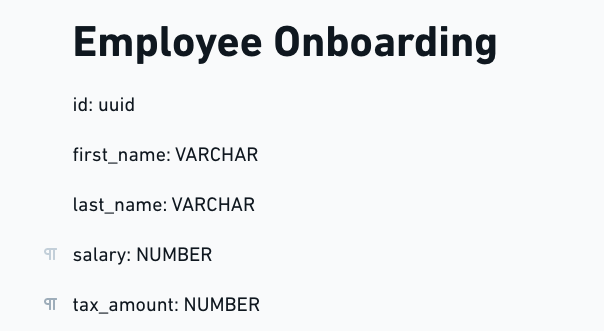

# employee_onboarding

## :pushpin: Objectives of the project

* A simple program which calculate the annual tax and superannuation for a given salary 

* A design of what information the new staff member onboarding form should contain

* A few written or programmed tests to prove the tax and superannuation calculations

## :camera_flash: Employee Onboarding

### Design of staff information

### Technologies: 
* Typescript
* ReactJs - libraries (Unform, axios, polished, react-icons, react-router-dom, styled-components)
* Node - libraries (cors, uuid) - Framework (Express)

## How to run this project
### Clone the repository using git
* $ git clone  https://github.com/FelipeCostaBR/employee_onboarding.git
* $ cd employee_onboarding

### Run the server and isntall the dependencies
* $ cd employee_onboarding/backend
* $ yarn
* $ yarn dev

### Open a new terminal and execute the commands bellow

### Run the frontend and isntall the dependencies
* $ cd employee_onboarding/frontend
* $ yarn
* $ yarn start

